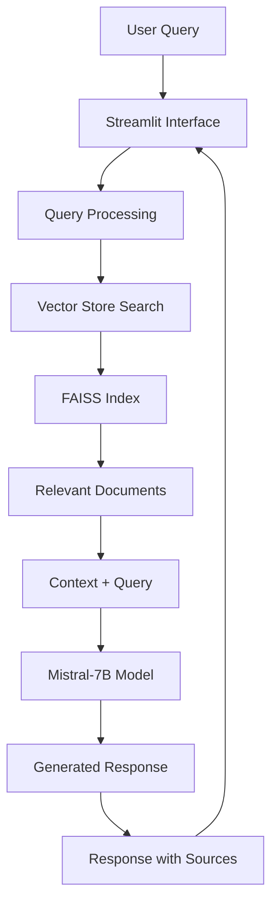

# LawBot---Your-Legal-Assistant
LawBot - Your Legal Assistant!
# 🏛️ LawBot - Legal AI Assistant


> **An intelligent legal assistant powered by AI to answer questions based on Indian law documents**

LawBot is a Retrieval-Augmented Generation (RAG) based chatbot specifically designed to provide accurate legal information from Indian law documents. It combines the power of large language models with a comprehensive knowledge base of legal texts to deliver precise, context-aware responses.

## 📋 Table of Contents

- [Features](#-features)
- [Demo](#-demo)
- [Architecture](#-architecture)
- [Prerequisites](#-prerequisites)
- [Installation](#-installation)
- [Configuration](#-configuration)
- [Usage](#-usage)
- [Data Sources](#-data-sources)
- [API Reference](#-api-reference)
- [Contributing](#-contributing)
- [Troubleshooting](#-troubleshooting)
- [Roadmap](#-roadmap)
- [License](#-license)
- [Acknowledgments](#-acknowledgments)

## ✨ Features

### Core Capabilities
- **🔍 Context-Aware Responses**: Uses RAG to provide answers based on actual legal documents
- **📚 Comprehensive Knowledge Base**: Built on essential Indian law documents including Constitution, IPC, CrPC, CPC, and more
- **💬 Interactive Chat Interface**: Clean, intuitive Streamlit-based web interface
- **🎯 Source Attribution**: Every response includes relevant source document references
- **🔒 Privacy-Focused**: No data stored externally; runs entirely on your infrastructure
- **⚡ Fast Retrieval**: Optimized vector search for quick response times

### Technical Features
- **🤖 Advanced NLP**: Powered by Mistral-7B-Instruct model via Hugging Face
- **🗃️ Vector Database**: FAISS-based efficient document retrieval
- **🔄 Session Management**: Maintains conversation context across interactions
- **📱 Responsive Design**: Works seamlessly on desktop and mobile devices
- **🛡️ Error Handling**: Robust error management and graceful degradation

## 🎬 Demo

```bash
# Quick start demo
git clone https://github.com/yourusername/lawbot
cd lawbot
pipenv install
pipenv run streamlit run app.py
```


## 🏗️ Architecture



### Components

| Component | Description | Technology |
|-----------|-------------|------------|
| **Frontend** | Web-based chat interface | Streamlit |
| **Vector Store** | Document embeddings and search | FAISS + HuggingFace Embeddings |
| **LLM** | Language model for response generation | Mistral-7B-Instruct |
| **Document Processing** | Text extraction and chunking | LangChain |
| **Orchestration** | RAG pipeline management | LangChain |

## 🔧 Prerequisites

### System Requirements
- **Python**: 3.8 or higher
- **Memory**: Minimum 8GB RAM (16GB recommended)
- **Storage**: 5GB free space for models and documents
- **Internet**: Required for initial model download

### Required Accounts
- **Hugging Face Account**: For model access
  - Sign up at [huggingface.co](https://huggingface.co)
  - Generate API token from Settings > Access Tokens

## 🚀 Installation

### Method 1: Using Pipenv (Recommended)

```bash
# Clone the repository
git clone https://github.com/yourusername/lawbot.git
cd lawbot

# Install pipenv if not already installed
pip install pipenv

# Install dependencies
pipenv install

# Activate virtual environment
pipenv shell
```

### Method 2: Using pip

```bash
# Clone the repository
git clone https://github.com/yourusername/lawbot.git
cd lawbot

# Create virtual environment
python -m venv lawbot_env
source lawbot_env/bin/activate  # On Windows: lawbot_env\Scripts\activate

# Install dependencies
pip install -r requirements.txt
```

### Method 3: Using Docker

```bash
# Build the Docker image
docker build -t lawbot .

# Run the container
docker run -p 8501:8501 -e HF_TOKEN=your_token_here lawbot
```

## ⚙️ Configuration

### 1. Environment Variables

Create a `.env` file in the project root:

```env
# Required
HF_TOKEN=your_huggingface_token_here
HUGGINGFACEHUB_API_TOKEN=your_huggingface_token_here

# Optional
MODEL_NAME=mistralai/Mistral-7B-Instruct-v0.3
EMBEDDINGS_MODEL=sentence-transformers/all-MiniLM-L6-v2
VECTOR_STORE_PATH=vector_store/db_faiss
MAX_NEW_TOKENS=512
TEMPERATURE=0.5
```

### 2. Document Setup

```bash
# Create vector store directory
mkdir -p vector_store

# Process your legal documents (see Data Sources section)
python scripts/create_vector_store.py --input data/legal_docs --output vector_store/db_faiss
```

### 3. Configuration Options

| Parameter | Default | Description |
|-----------|---------|-------------|
| `MODEL_NAME` | `mistralai/Mistral-7B-Instruct-v0.3` | Hugging Face model identifier |
| `EMBEDDINGS_MODEL` | `sentence-transformers/all-MiniLM-L6-v2` | Embedding model for documents |
| `MAX_NEW_TOKENS` | `512` | Maximum tokens in model response |
| `TEMPERATURE` | `0.5` | Model creativity (0.0-1.0) |
| `SEARCH_K` | `3` | Number of documents to retrieve |

## 🎮 Usage

### Starting the Application

```bash
# Using pipenv
pipenv run streamlit run app.py

# Using pip
python -m streamlit run app.py

# Using Docker
docker run -p 8501:8501 lawbot
```

Access the application at `http://localhost:8501`

### Example Queries

```
🔍 Sample Questions You Can Ask:

• "What are the fundamental rights guaranteed by the Indian Constitution?"
• "Explain the difference between IPC Section 302 and 304"
• "What is the procedure for filing a civil suit?"
• "What are the essential elements of a valid contract?"
• "Explain the concept of anticipatory bail"
```

### API Usage

```python
from lawbot import LawBot

# Initialize the bot
bot = LawBot()

# Ask a question
response = bot.ask("What is Article 21 of Indian Constitution?")
print(response.answer)
print(response.sources)
```

## 📚 Data Sources

### Included Legal Documents

| Document | Coverage | Size | Status |
|----------|----------|------|--------|
| Constitution of India | Fundamental law | ~2MB | ✅ Included |
| Indian Penal Code (IPC) | Criminal law | ~500KB | ✅ Included |
| Code of Criminal Procedure (CrPC) | Criminal procedure | ~800KB | ✅ Included |
| Code of Civil Procedure (CPC) | Civil procedure | ~600KB | ✅ Included |
| Indian Evidence Act | Evidence law | ~300KB | ✅ Included |
| Indian Contract Act | Contract law | ~400KB | 🔄 Planned |
| Companies Act 2013 | Corporate law | ~2MB | 🔄 Planned |

### Adding New Documents

1. **Prepare Documents**
   ```bash
   # Place PDF files in the data directory
   mkdir -p data/legal_docs
   cp your_legal_document.pdf data/legal_docs/
   ```

2. **Process Documents**
   ```bash
   # Run the document processing script
   python scripts/process_documents.py
   ```

3. **Update Vector Store**
   ```bash
   # Rebuild the vector store
   python scripts/create_vector_store.py
   ```

## 📖 API Reference

### Core Classes

#### `LawBot`
Main chatbot class handling query processing and response generation.

```python
class LawBot:
    def __init__(self, config_path: str = "config.yaml")
    def ask(self, question: str) -> LawBotResponse
    def get_relevant_docs(self, query: str) -> List[Document]
    def clear_history(self) -> None
```

#### `LawBotResponse`
Response object containing answer and sources.

```python
@dataclass
class LawBotResponse:
    answer: str
    sources: List[DocumentSource]
    confidence: float
    processing_time: float
```

### Configuration

#### `config.yaml`
```yaml
model:
  name: "mistralai/Mistral-7B-Instruct-v0.3"
  temperature: 0.5
  max_tokens: 512

embeddings:
  model: "sentence-transformers/all-MiniLM-L6-v2"
  
vector_store:
  path: "vector_store/db_faiss"
  search_k: 3

documents:
  chunk_size: 1000
  chunk_overlap: 200
```

## 🤝 Contributing

We welcome contributions! Please see our [Contributing Guide](CONTRIBUTING.md) for details.

### Development Setup

```bash
# Fork and clone the repository
git clone https://github.com/yourusername/lawbot.git
cd lawbot

# Install development dependencies
pipenv install --dev

# Install pre-commit hooks
pre-commit install

# Run tests
pytest tests/

# Run linting
black . && flake8 . && mypy .
```

### Contribution Areas

- 📚 **Document Addition**: Add more legal documents
- 🐛 **Bug Fixes**: Report and fix issues
- ✨ **Feature Enhancement**: Improve existing features
- 📖 **Documentation**: Improve documentation
- 🧪 **Testing**: Add test cases
- 🎨 **UI/UX**: Enhance user interface

### Reporting Issues

Please use our [Issue Template](.github/ISSUE_TEMPLATE.md) when reporting bugs or requesting features.

## 🔧 Troubleshooting

### Common Issues

#### 1. "Vector store could not be loaded"
```bash
# Solution: Ensure vector store exists
python scripts/create_vector_store.py
```

#### 2. "HuggingFace token not found"
```bash
# Solution: Set environment variable
export HF_TOKEN=your_token_here
```

#### 3. "Model loading failed"
```bash
# Solution: Check internet connection and token permissions
# Verify token has read access to the model
```

#### 4. "Out of memory error"
```bash
# Solution: Reduce model parameters
# Edit config.yaml:
model:
  max_tokens: 256  # Reduce from 512
```

### Performance Optimization

#### For Low-Memory Systems
```yaml
# config.yaml
model:
  load_in_8bit: true
  device_map: "auto"
  
vector_store:
  search_k: 2  # Reduce from 3
```

#### For Faster Responses
```yaml
# config.yaml
model:
  max_tokens: 256
  temperature: 0.3
  
embeddings:
  batch_size: 32
```

### Debug Mode

```bash
# Enable debug logging
export LAWBOT_DEBUG=true
streamlit run app.py
```

## 🗺️ Roadmap

### Version 1.1 (Q4 2024)
- [ ] **Multi-language Support**: Hindi and regional languages
- [ ] **Advanced Search**: Semantic and boolean search options
- [ ] **Case Law Integration**: Supreme Court and High Court judgments
- [ ] **Export Features**: PDF and Word document generation

### Version 1.2 (Q1 2025)
- [ ] **Voice Interface**: Speech-to-text and text-to-speech
- [ ] **Mobile App**: React Native mobile application
- [ ] **API Gateway**: RESTful API for third-party integration
- [ ] **Analytics Dashboard**: Usage metrics and insights

### Version 2.0 (Q2 2025)
- [ ] **Multi-modal Input**: Image and document upload
- [ ] **Legal Drafting**: Automated legal document creation
- [ ] **Citation Checking**: Verify legal citations and references
- [ ] **Integration Plugins**: Slack, Teams, and other platforms

## 📄 License

This project is licensed under the MIT License - see the [LICENSE](LICENSE) file for details.

```
MIT License

Copyright (c) 2024 LawBot Contributors

Permission is hereby granted, free of charge, to any person obtaining a copy
of this software and associated documentation files (the "Software"), to deal
in the Software without restriction, including without limitation the rights
to use, copy, modify, merge, publish, distribute, sublicense, and/or sell
copies of the Software...
```

## 🙏 Acknowledgments

### Technologies
- **[Streamlit](https://streamlit.io/)**: For the amazing web framework
- **[LangChain](https://python.langchain.com/)**: For RAG implementation
- **[Hugging Face](https://huggingface.co/)**: For model hosting and embeddings
- **[FAISS](https://faiss.ai/)**: For efficient vector search
- **[Mistral AI](https://mistral.ai/)**: For the powerful language model

### Data Sources
- **Government of India**: For providing open access to legal documents
- **India Code**: For comprehensive legal database
- **National Archives**: For historical legal documents

### Contributors
- [@yourusername](https://github.com/yourusername) - Project Creator
- [@contributor1](https://github.com/contributor1) - Document Processing
- [@contributor2](https://github.com/contributor2) - UI/UX Design

### Special Thanks
- Legal experts who provided domain knowledge
- Beta testers who helped improve the system
- Open source community for invaluable tools and libraries

---

## 📞 Support & Contact

- **Documentation**: [Wiki](https://github.com/yourusername/lawbot/wiki)
- **Issues**: [GitHub Issues](https://github.com/yourusername/lawbot/issues)
- **Discussions**: [GitHub Discussions](https://github.com/yourusername/lawbot/discussions)
- **Email**: lawbot.support@example.com

---

<div align="center">

**⭐ Star this repository if you find it helpful!**

[Report Bug](https://github.com/yourusername/lawbot/issues) · [Request Feature](https://github.com/yourusername/lawbot/issues) · [Documentation](https://github.com/yourusername/lawbot/wiki)

**Made with ❤️ for the legal community**

</div>

---

### 📊 Project Stats


### 🔗 Quick Links

| Resource | Link |
|----------|------|
| 🏠 Homepage | [Project Website](https://lawbot.example.com) |
| 📖 Documentation | [Full Docs](https://docs.lawbot.example.com) |
| 🎮 Live Demo | [Try LawBot](https://demo.lawbot.example.com) |
| 💬 Community | [Discord Server](https://discord.gg/lawbot) |
| 🐦 Updates | [Twitter](https://twitter.com/lawbot_ai) |