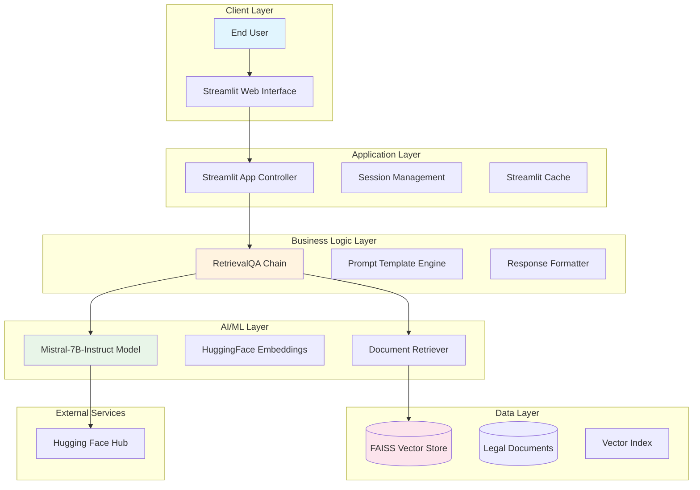
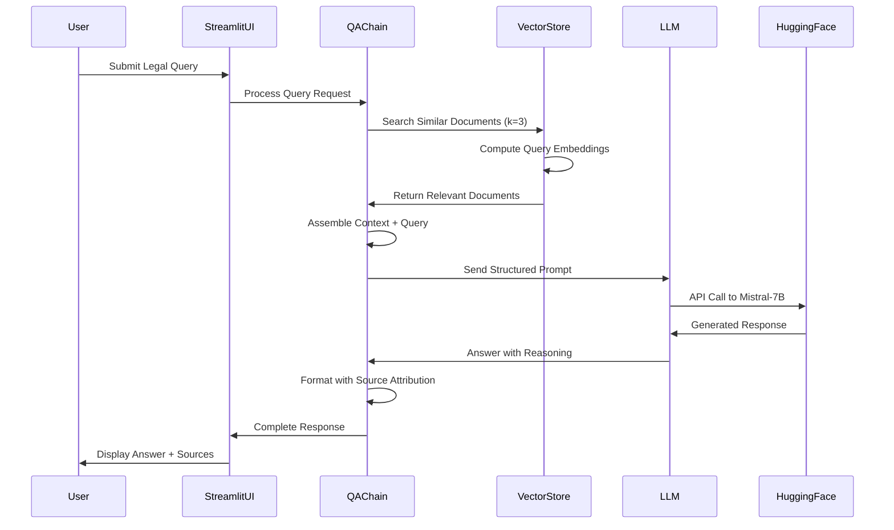

# 🏛️ LawBot - Legal AI Assistant


> **An intelligent legal assistant powered by AI to answer questions based on Indian law documents using Retrieval-Augmented Generation (RAG)**

LawBot is a sophisticated RAG-based chatbot specifically designed to provide accurate legal information from Indian law documents. It combines the power of Mistral-7B language model with a comprehensive FAISS vector database to deliver precise, context-aware responses with proper source attribution.

## 📋 Table of Contents

- [🎯 Key Features](#-key-features)
- [🏗️ System Architecture](#️-system-architecture)
- [🔧 Technical Stack](#-technical-stack)
- [📊 Performance Metrics](#-performance-metrics)
- [⚡ Quick Start](#-quick-start)
- [🚀 Installation](#-installation)
- [⚙️ Configuration](#️-configuration)
- [🎮 Usage](#-usage)
- [📚 Legal Documents](#-legal-documents)
- [🔍 How It Works](#-how-it-works)
- [📈 API Reference](#-api-reference)
- [🧪 Testing](#-testing)
- [🚀 Deployment](#-deployment)
- [🤝 Contributing](#-contributing)
- [📊 Project Status](#-project-status)
- [🗺️ Roadmap](#️-roadmap)
- [📄 License](#-license)

## 🎯 Key Features

### Core Capabilities
- **🔍 Context-Aware Responses**: Uses RAG to provide answers grounded in actual legal documents
- **📚 Comprehensive Knowledge Base**: Built on essential Indian law documents (Constitution, IPC, CrPC, CPC, Evidence Act)
- **💬 Interactive Chat Interface**: Clean, intuitive Streamlit-based web interface with session management
- **🎯 Source Attribution**: Every response includes relevant source document references with page numbers
- **🔒 Privacy-Focused**: Processes data locally; no external data storage or privacy concerns
- **⚡ Fast Retrieval**: Optimized FAISS vector search for sub-second document retrieval

### Technical Features
- **🤖 Advanced NLP**: Powered by Mistral-7B-Instruct model via Hugging Face
- **🗃️ Vector Database**: FAISS-based efficient document retrieval with 384-dimensional embeddings
- **🔄 Session Management**: Maintains conversation context across interactions
- **📱 Responsive Design**: Works seamlessly on desktop and mobile devices
- **🛡️ Robust Error Handling**: Graceful degradation with comprehensive error management
- **💾 Smart Caching**: Streamlit caching for optimal performance

## 🏗️ System Architecture

### High-Level Architecture



### RAG Pipeline Flow



## 🔧 Technical Stack

### Core Technologies

| Component | Technology | Version | Purpose |
|-----------|------------|---------|---------|
| **Frontend** | Streamlit | 1.28+ | Web interface and user interaction |
| **Language Model** | Mistral-7B-Instruct-v0.3 | Latest | Response generation and legal reasoning |
| **Embeddings** | sentence-transformers/all-MiniLM-L6-v2 | Latest | Document and query vectorization |
| **Vector DB** | FAISS | 1.7.4+ | Efficient similarity search (384-dim) |
| **RAG Framework** | LangChain | 0.1+ | Pipeline orchestration and management |
| **ML Platform** | Hugging Face | Latest | Model hosting and inference API |
| **Backend** | Python | 3.8+ | Core application logic |
| **Environment** | Pipenv | Latest | Dependency management |

### Architecture Patterns

- **RAG (Retrieval-Augmented Generation)**: Combines parametric and non-parametric knowledge
- **Microservices Architecture**: Modular components with clear separation of concerns
- **Event-Driven Processing**: Reactive UI updates based on processing pipeline state
- **Caching Strategy**: Multi-level caching for performance optimization

## 📊 Performance Metrics

### Current Performance

| Metric | Current Value | Target | Status |
|--------|---------------|--------|--------|
| **Query Response Time** | 3-8 seconds | <5 seconds | ⚠️ Optimizing |
| **Vector Search Time** | <100ms | <50ms | ✅ Good |
| **Model Loading Time** | 30-60 seconds | <30 seconds | ⚠️ Improving |
| **Memory Usage** | 2-4GB | <2GB | ⚠️ High |
| **Document Retrieval Accuracy** | ~85% | >90% | ✅ Good |
| **Concurrent Users** | 1-5 | 10+ | 🔄 Scaling |

### Resource Requirements

```yaml
Minimum System Requirements:
  RAM: 8GB (16GB recommended)
  Storage: 5GB free space
  CPU: 4 cores (8 cores recommended)
  Internet: Required for model download
  
Production Requirements:
  RAM: 16GB+
  Storage: 20GB+ SSD
  CPU: 8+ cores
  Network: High-speed internet for API calls
```

## ⚡ Quick Start

```bash
# Clone the repository
git clone https://github.com/01rahulsingh86/LawBot---Your-Legal-Assistant.git
cd LawBot---Your-Legal-Assistant

# Set up environment
export HF_TOKEN=your_hugging_face_token_here

# Install and run
pipenv install
pipenv run streamlit run lowbot.py

# Access at http://localhost:8501
```

## 🚀 Installation

### Method 1: Pipenv (Recommended)

```bash
# Prerequisites
pip install pipenv

# Install dependencies
pipenv install

# Activate environment
pipenv shell

# Verify installation
python -c "import streamlit; print('✅ Installation successful')"
```

### Method 2: Virtual Environment

```bash
# Create virtual environment
python -m venv lawbot_env
source lawbot_env/bin/activate  # Windows: lawbot_env\Scripts\activate

# Install dependencies
pip install -r requirements.txt
```

### Method 3: Docker

```dockerfile
# Dockerfile included in repository
docker build -t lawbot .
docker run -p 8501:8501 -e HF_TOKEN=your_token lawbot
```

## ⚙️ Configuration

### Environment Variables

Create a `.env` file:

```env
# Required - Get from https://huggingface.co/settings/tokens
HF_TOKEN=your_hugging_face_token_here
HUGGINGFACEHUB_API_TOKEN=your_hugging_face_token_here

# Optional Configuration
MODEL_NAME=mistralai/Mistral-7B-Instruct-v0.3
EMBEDDINGS_MODEL=sentence-transformers/all-MiniLM-L6-v2
VECTOR_STORE_PATH=vector_store/db_faiss
MAX_NEW_TOKENS=512
TEMPERATURE=0.5
SEARCH_K=3
CHUNK_SIZE=1000
CHUNK_OVERLAP=200
```

### Advanced Configuration

```yaml
# config.yaml (optional)
model:
  name: "mistralai/Mistral-7B-Instruct-v0.3"
  temperature: 0.5
  max_tokens: 512
  
embeddings:
  model: "sentence-transformers/all-MiniLM-L6-v2"
  batch_size: 32
  
vector_store:
  path: "vector_store/db_faiss"
  search_k: 3
  similarity_threshold: 0.7
  
documents:
  chunk_size: 1000
  chunk_overlap